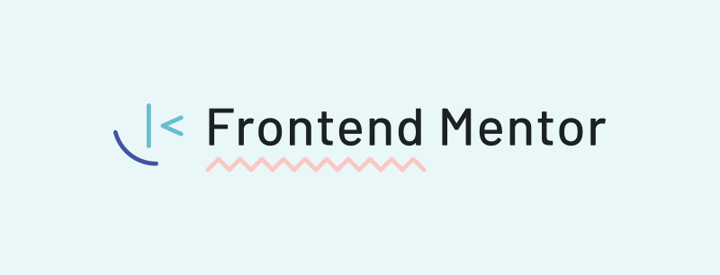

# Frontend Mentor Challenges

This repository was created to show my approaches to the challenges proposed by Frontend Mentor.

### :computer: **Frontend Mentor**

[Frontend Mentor](https://www.frontendmentor.io/) is a website that basically helps people to improve their skills, as the name goes, with frontend development. You have free access to many challenges, which you can take based on levels of difficulty, going from 'Newbie' to 'Guru'. There's also a PRO plan that gives access to some more challenges and also some perks on their website, but I'm not taking it, not yet at least.

**They'll give you only the images, colors and fonts they used. The coding part is all up to you. Or me, actually.** 

### :scroll: **Why are you doing this?**

Basically, to improve my web development skills. I've always liked building websites, but have always done that using wordpress. To start learning web development, understanding HTML and CSS properly seems to be the first step. The experience metric on the website is very helpful when it comes to getting a grasp of new things and it also gives you ideas on what to build, so I don't see why it would be a bad idea to try it on.

### 👩‍💻 **Technologies**

### :bookmark_tabs: **Projects** (ongoing)

* [QR Code Component](https://github.com/e-meyer/frontend-mentor/tree/main/qr-code-component)

* [NFT Preview Component](https://github.com/e-meyer/frontend-mentor/tree/main/nft-preview-component)

* [Order Summary Component](https://github.com/e-meyer/frontend-mentor/tree/main/order-summary-component-main)

